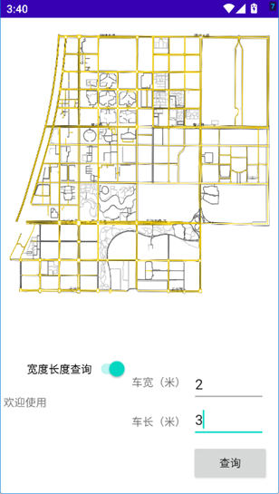

# 🚛 大型车辆道路导航系统

[](https://android.com)
[](https://kotlinlang.org)
[](LICENSE)
[](https://developer.android.com)

> 🎯 **专为大型车辆设计的智能导航解决方案** - 基于车辆尺寸的路径规划与碰撞检测

一款专门为超长超宽车辆设计的Android导航应用，通过Dijkstra算法和转弯碰撞检测技术，为大型车辆提供安全可行的最优路径规划。

## ✨ 主要特性

🛣️ **智能路径规划**
- 基于Dijkstra最短路径算法
- 考虑车辆宽度、长度的动态权重计算
- 实时路径优化与重新规划

🚧 **碰撞检测系统**
- 转弯处几何碰撞检测算法
- 道路宽度限制判断
- 安全通行性评估

🗺️ **可视化地图**
- 自定义Canvas地图渲染
- 多层地图数据显示
- 实时路径可视化

👤 **用户体验**
- 简洁的登录注册系统
- 启动动画页面
- 响应式UI设计

## 📱 应用截图

<div align="center">

### 🎯 核心功能展示

<table>
  <tr>
    <td align="center">
      
      <br />
      <strong>🗺️ 地图主界面</strong>
      <br />
      <sub>自定义地图渲染与交互</sub>
    </td>
    <td align="center">
      
      <br />
      <strong>🛣️ 路径规划</strong>
      <br />
      <sub>智能路径计算与可视化</sub>
    </td>
  </tr>
</table>

</div>

### 🎨 界面设计特点

- **🎯 Material Design 3**: 现代化设计语言
- **🌓 主题适配**: 支持明暗主题切换  
- **📱 响应式布局**: 适配不同屏幕尺寸
- **✨ 流畅动画**: Lottie 动画增强体验
- **🎨 直观图标**: 清晰的功能标识

> 💡 **说明**: 截图展示了应用的主要界面，实际使用中界面可能因设备而异

## 🔧 技术栈

| 技术 | 版本 | 用途 |
|------|------|------|
| **Kotlin** | 2.0.0 | 主要开发语言 |
| **Android SDK** | 35 | 平台框架 |
| **Jetpack Compose** | 最新 | 现代UI框架 |
| **Lottie** | 6.0.0 | 动画效果 |
| **Material Design 3** | 最新 | 设计系统 |

## 🚀 快速开始

### 系统要求

- **Android**: 11.0 (API level 30) 或更高版本
- **内存**: 最少 2GB RAM
- **存储**: 至少 100MB 可用空间

### 安装方式

#### 方式一：直接下载APK
```
链接：https://pan.baidu.com/s/1vjL6CcClrUv1rfCIpQNuzw?pwd=tj8a 
提取码：tj8a
```

#### 方式二：从源码构建
```bash
# 克隆仓库
git clone https://github.com/x01914171/car_guidance.git

# 进入项目目录
cd car_guidance

# 构建项目
./gradlew assembleDebug

# 安装到设备
./gradlew installDebug
```

### 开发环境设置

1. **Android Studio**: Arctic Fox 或更新版本
2. **Java**: JDK 11 或更高版本
3. **Gradle**: 8.10.2

```bash
# 检查构建环境
./gradlew build

# 运行测试
./gradlew test

# 检查代码质量
./gradlew lint
```

## 💡 使用方法

### 基本导航流程

1. **启动应用** - 观看欢迎动画
2. **用户登录** - 输入用户名密码（演示账号：admin/123456）
3. **设置车辆信息** - 输入车辆宽度和长度
4. **选择起终点** - 在地图上点击选择两个位置点
5. **路径规划** - 选择标准模式或车辆约束模式
6. **查看结果** - 系统显示最优路径和总距离

### 高级功能

#### 🔧 车辆约束模式
启用开关后，系统将：
- 根据车辆尺寸计算通行权重
- 检测转弯处碰撞风险
- 自动排除不可通行路段

#### 🗺️ 地图操作
- **平移**: 单指拖拽移动地图
- **缩放**: 双指捏合缩放地图
- **选点**: 单击选择起点和终点

## 🏗️ 项目架构

```
app/src/main/java/com/example/guidance/
├── 📱 Activities
│   ├── MainActivity.kt          # 主界面和路径规划逻辑
│   ├── LoginActivity.kt         # 用户登录
│   ├── RegisterActivity.kt      # 用户注册
│   └── AnimationActivity.kt     # 启动动画
├── 🧠 算法核心
│   ├── Graph.kt                 # 图数据结构
│   ├── dijkstra.kt             # 最短路径算法
│   └── CornerJudge.kt          # 转弯碰撞检测
├── 🗺️ 地图渲染
│   └── MyView.kt               # 自定义地图视图
├── 📊 数据模型
│   └── cla.kt                  # 数据类定义
└── 🎨 UI主题
    └── ui/theme/               # Material Design 主题
```

### 核心算法说明

#### Dijkstra 路径规划
```kotlin
// 权重计算公式（车辆约束模式）
权重 = (车辆宽度/道路宽度) × 500 + 道路长度
```

#### 转弯碰撞检测
- 经纬度坐标转换为平面坐标系统
- 车辆矩形几何建模
- 多边形相交判断算法

## 📂 数据格式

应用使用以下数据文件（位于 `assets/` 目录）：

| 文件 | 格式 | 说明 |
|------|------|------|
| `points.txt` | `ID,X,Y` | 端点坐标数据 |
| `lines.txt` | `起点ID,终点ID,长度,宽度` | 道路线段信息 |
| `allpoints.txt` | `ID,线ID,X,Y,宽度` | 道路中心线点 |
| `corner.txt` | `ID,线ID,类型,X,Y` | 转弯处数据 |
| `polygon_pois.txt` | `点ID,多边形ID,X,Y` | 道路多边形数据 |

## 🤝 贡献指南

欢迎贡献代码！请遵循以下步骤：

1. **Fork** 本仓库
2. **创建特性分支**: `git checkout -b feature/AmazingFeature`
3. **提交更改**: `git commit -m 'Add some AmazingFeature'`
4. **推送分支**: `git push origin feature/AmazingFeature`
5. **提交 Pull Request**

### 代码规范

- 遵循 [Kotlin 编码规范](https://kotlinlang.org/docs/coding-conventions.html)
- 使用有意义的变量和函数名
- 添加必要的注释和文档
- 确保所有测试通过

## 📝 更新日志

### v1.0.0 (2024-01-XX)
- 🎉 首次发布
- ✅ 基础路径规划功能
- ✅ 转弯碰撞检测
- ✅ 用户认证系统
- ✅ 地图可视化

## 🐛 问题反馈

如果您发现bug或有功能建议，请：

1. 查看 [Issues](../../issues) 确认问题未被报告
2. 创建新的 Issue，详细描述问题
3. 附上相关截图和设备信息

## 📄 许可证

本项目采用 MIT 许可证 - 查看 [LICENSE](LICENSE) 文件了解详情

## 👥 项目团队

本项目为**安徽大学地理信息科学专业**2019级大学生创新创业项目

- 🎯 **目标**: 解决大型车辆在陌生道路行驶的安全问题
- 🔬 **技术**: 结合ArcGIS、A*算法和碰撞检测技术
- 🚀 **愿景**: 为物流运输行业提供专业的导航解决方案

---

<div align="center">

**⭐ 如果这个项目对您有帮助，请给个星星！**

[报告Bug](../../issues) · [功能建议](../../issues) · [开发文档](CLAUDE.md)

</div> 


